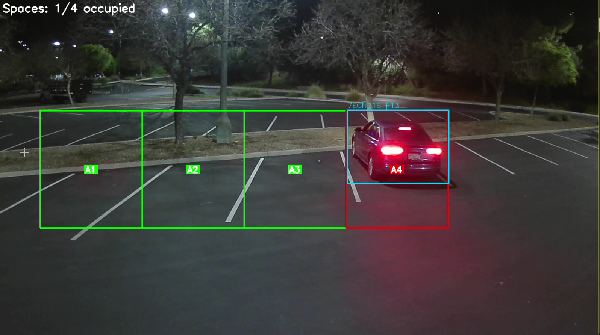
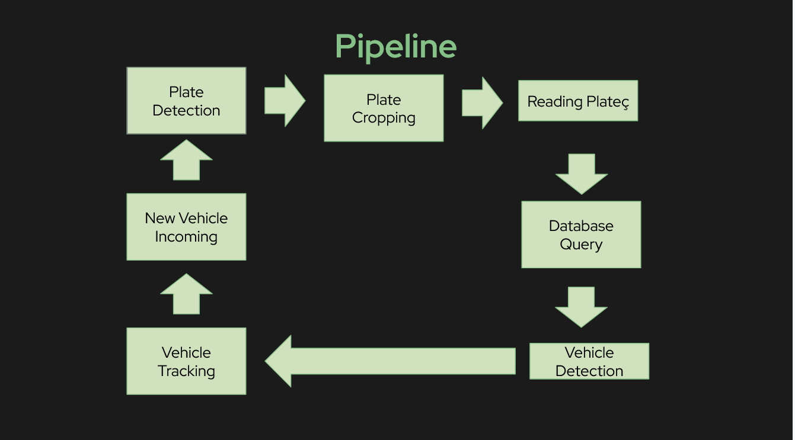

# **Edge AI License Plate Recognition System**

Real-time license plate detection and OCR running entirely on the edge using a Raspberry Pi 5 with AI acceleration.

## **Demo**
[](https://youtu.be/jM9ZgLdmsQY)

## **Installation**
```bash
git clone https://github.com/your-username/your-repo-name.git
cd your-repo-name

pip install -r requirements.txt

python main.py
```

## **Tech Stack**

| Component | Technology |
|-----------|------------|
| Language  | Python     |
| Model | YOLOv8s |
| Hardware  | Hailo-8    |
|Accelorator| [Hailo-8L (AI HAT+)](https://www.raspberrypi.com/products/ai-hat/)|
| Containerization | [Docker](https://www.docker.com/) |


## **Hardware Requirements**
Raspberry Pi 5 (8GB recommended)
- Raspberry Pi AI HAT+ (Hailo-8L NPU)
- Raspberry Pi Camera Module (v2 or v3)
- MicroSD card (32GB+)
- Power supply (5V/5A USB-C)
- [NexiGo N60 1080P Webcam](https://www.amazon.com/Microphone-NexiGo-Computer-110-degree-Conferencing/dp/B088TSR6YJ)

## **Pipeline**


## **Contributors**
- Jerome Guan
- Natalie Wu
- Oscar La
- Sarik Karki
  
